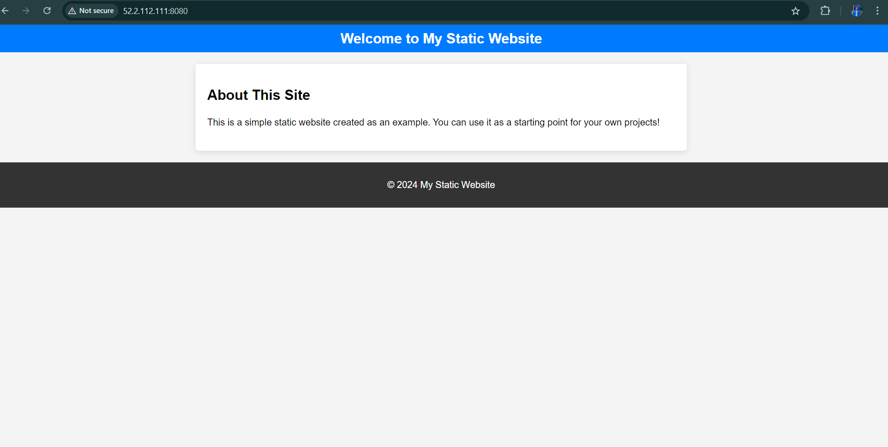

# Deploy Static Website 
Here are the steps to Dockerize a static website using Nginx:


## Firstly install docker in your system

```bash
sudo apt-get update
sudo apt-get install docker.io
```

### Give all permissions to run the docker.

Let start-->>

### Step-1

```bash
mkdir project-1
cd project-1
```

#### Let make the index.html file and  Dockerfile for build the project.

```bash
vim index.html
```
```bash
<!DOCTYPE html>
<html lang="en">
<head>
    <meta charset="UTF-8">
    <meta name="viewport" content="width=device-width, initial-scale=1.0">
    <title>My Static Website</title>
    <style>
        body {
            font-family: Arial, sans-serif;
            margin: 0;
            padding: 0;
            background-color: #f5f5f5;
        }
        header {
            background-color: #007bff;
            color: white;
            padding: 10px;
            text-align: center;
            font-size: 24px;
        }
        .container {
            margin: 20px auto;
            max-width: 800px;
            padding: 20px;
            background-color: white;
            box-shadow: 0px 0px 10px rgba(0, 0, 0, 0.1);
            border-radius: 10px;
        }
        footer {
            background-color: #333;
            color: white;
            text-align: center;
            padding: 10px;
            position: fixed;
            left: 0;
            bottom: 0;
            width: 100%;
        }
    </style>
</head>
<body>
    <header>
        Welcome to My Static Website
    </header>

    <div class="container">
        <h2>About This Site</h2>
        <p>This is a simple static website created as an example. You can use it as a starting point for your own projects!</p>
    </div>

    <footer>
        &copy; 2024 My Static Website
    </footer>
</body>
</html>

```
### Step-2
```bash
vim Dockerfile
```

```bash
FROM nginx:alpine
COPY index.html /usr/share/nginx/html
EXPOSE 80
```
### Step-3

Run these commands on terminal...

```bash
docker build -t myproject1 .
```

Now check the current images: there are two images one is nginx and second is myproject1

```bash
docker run -d -p 80:80 --name=myproject1 myproject1
```

Now check the running container...

### Open the web browser and enter the ip 0.0.0.0:80(localhost) or if you are using AWS EC2 instance you can use their own public ip

# RESULT :-


